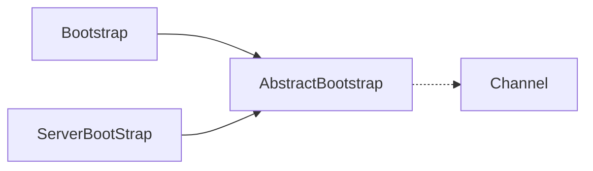
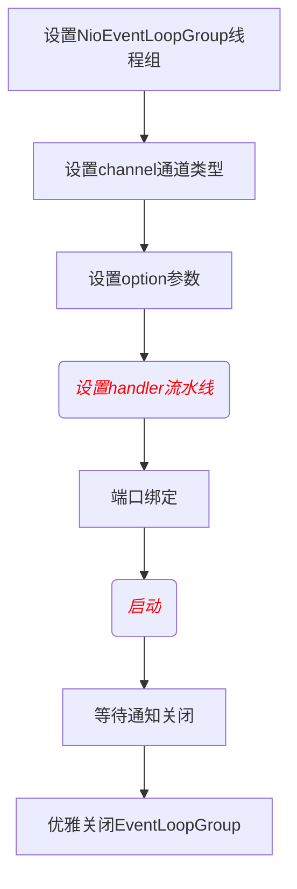
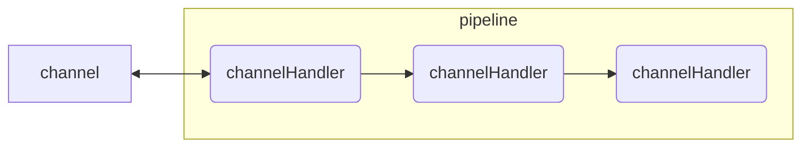
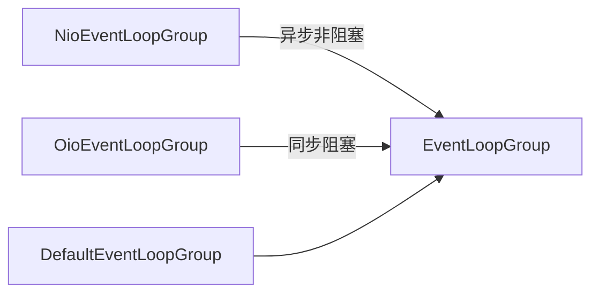

# 重要特性
## taskQueue任务队列
如果Handler处理器有一些长时间的业务处理，可以交给taskQueue异步处理。

**_serverHandler的channelRead中修改方法_**
```java
// 如果Handler处理器有一些长时间的业务处理，可以交给taskQueue异步处理
        ctx.channel().eventLoop().execute(()->{
            try {
                //长时间操作，不至于长时间的业务操作导致Handler阻塞
                Thread.sleep(1000);
                System.out.println("长时间的业务处理");
            } catch (InterruptedException e) {
                throw new RuntimeException(e);
            }
        });
```
## scheduleTaskQueue延时任务队列
延时任务队列和上面介绍的任务队列非常相似，只是多了一个可延迟一定时间再执行的设置

**_serverHandler的channelRead中修改方法_**
```java
//scheduleTaskQueue延时任务队列
        ctx.channel().eventLoop().schedule(()->{
            try {
                //长时间操作，不至于长时间的业务操作导致Handler阻塞
                Thread.sleep(1000);
                System.out.println("长时间的业务处理");
            } catch (Exception e) {
                e.printStackTrace();
            }
        },5, TimeUnit.SECONDS);//5秒后执行
```
## Future异步机制
```java
ChannelFuture channelFuture = bootstrap.connect("127.0.0.1", 6666);
```
ChannelFuture提供操作完成时一种异步通知的方式。一般在Socket编程中，等待响应结果都是同步阻塞的，而Netty则不会造成阻塞，因为ChannelFuture是采取类似观察者模式的形式进行获取结果
```java
 channelFuture.addListener(new ChannelFutureListener() {
                @Override
                public void operationComplete(ChannelFuture future) throws Exception {
                    if (future.isSuccess()) {
                        System.out.println("连接成功");
                    } else {
                        System.out.println("连接失败");
                    }
                }
            });
```
## Bootstrap与ServerBootStrap
1. Bootstrap 客户端的工厂类
2. ServerBootStrap 服务端的工厂类


## group
1. bossGroup 用于监听客户端连接，专门负责与客户端创建连接，并把连接注册到workerGroup的Selector中。
2. workerGroup用于处理每一个连接发生的读写事件。
```java
//设置bossGroup线程数为1
EventLoopGroup bossGroup = new NioEventLoopGroup(1);
//设置workerGroup线程数为16
EventLoopGroup workerGroup = new NioEventLoopGroup(16);
```
## channel
这个方法用于设置通道类型，当建立连接后，会根据这个设置创建对应的Channel实例。
1. NioSocketChannel： 异步非阻塞的客户端 TCP Socket 连接。
2. NioServerSocketChannel： 异步非阻塞的服务器端 TCP Socket 连接。
3. OioSocketChannel： 同步阻塞的客户端 TCP Socket 连接。
4. OioServerSocketChannel： 同步阻塞的服务器端 TCP Socket 连接。

## option()与childOption()
1. option()设置的是服务端用于接收进来的连接，也就是boosGroup线程。
2. childOption()是提供给父管道接收到的连接，也就是workerGroup线程。
SocketChannel参数，也就是childOption()常用的参数：<br>
> 1. SO_RCVBUF Socket参数，TCP数据接收缓冲区大小。
> 2. TCP_NODELAY TCP参数，立即发送数据，默认值为Ture。
> 3. SO_KEEPALIVE Socket参数，连接保活，默认值为False。启用该功能时，TCP会主动探测空闲连接的有效性。

ServerSocketChannel参数，也就是option()常用参数：
> SO_BACKLOG Socket参数，服务端接受连接的队列长度，如果队列已满，客户端连接将被拒绝。默认值，Windows为200，其他为128。

## 设置流水线(重点) Pipeline
hannelPipeline是Netty处理请求的责任链，ChannelHandler则是具体处理请求的处理器。
在Bootstrap中childHandler()方法需要初始化通道，实例化一个ChannelInitializer，这时候需要重写initChannel()初始化通道的方法，装配流水线就是在这个地方进行。
```java
//使用匿名内部类的形式初始化通道对象
bootstrap.childHandler(new ChannelInitializer<SocketChannel>() {
    @Override
    protected void initChannel(SocketChannel socketChannel) throws Exception {
        //给pipeline管道设置自定义的处理器
        socketChannel.pipeline().addLast(new MyServerHandler());
    }
});
```
ChannelInboundHandlerAdapter(入站处理器)、ChannelOutboundHandler(出站处理器)
入站指的是数据从底层java NIO Channel到Netty的Channel。
出站指的是通过Netty的Channel来操作底层的java NIO Channel。

## bind
提供用于服务端或者客户端绑定服务器地址和端口号，默认是异步启动。如果加上sync()方法则是同步。

## 优雅地关闭EventLoopGroup
```java
//释放掉所有的资源，包括创建的线程
bossGroup.shutdownGracefully();
workerGroup.shutdownGracefully();
```

## Channel
一种连接到网络套接字或能进行读、写、连接和绑定等I/O操作的组件
1. 通道当前的状态（例如它是打开？还是已连接？）
2. channel的配置参数（例如接收缓冲区的大小）
3. channel支持的IO操作（例如读、写、连接和绑定），以及处理与channel相关联的所有IO事件和请求的ChannelPipeline。
```java
boolean isOpen(); //如果通道打开，则返回true
boolean isRegistered();//如果通道注册到EventLoop，则返回true
boolean isActive();//如果通道处于活动状态并且已连接，则返回true
boolean isWritable();//当且仅当I/O线程将立即执行请求的写入操作时，返回true
```
### 获取channel的配置参数
获取单条配置信息，使用getOption()
```java
ChannelConfig config = channel.config();//获取配置参数
//获取ChannelOption.SO_BACKLOG参数,
Integer soBackLogConfig = config.getOption(ChannelOption.SO_BACKLOG);
//因为我启动器配置的是128，所以我这里获取的soBackLogConfig=128
```
获取多条配置信息，使用getOptions()
```java
ChannelConfig config = channel.config();
Map<ChannelOption<?>, Object> options = config.getOptions();
for (Map.Entry<ChannelOption<?>, Object> entry : options.entrySet()) {
    System.out.println(entry.getKey() + " : " + entry.getValue());
}
/**
SO_REUSEADDR : false
WRITE_BUFFER_LOW_WATER_MARK : 32768
WRITE_BUFFER_WATER_MARK : WriteBufferWaterMark(low: 32768, high: 65536)
SO_BACKLOG : 128
以下省略...
*/
```
### channel支持的IO操作
写操作，这里演示从服务端写消息发送到客户端：
```java
@Override
public void channelRead(ChannelHandlerContext ctx, Object msg) throws Exception {
    ctx.channel().writeAndFlush(Unpooled.copiedBuffer("这波啊，这波是肉蛋葱鸡~", CharsetUtil.UTF_8));
}
```
连接操作，代码演示：
```java
ChannelFuture connect = channelFuture.channel().connect(new InetSocketAddress("127.0.0.1", 6666));//一般使用启动器，这种方式不常用
// ChannelFuture channelFuture = bootstrap.connect("127.0.0.1", 6666).sync();
```
通过channel获取ChannelPipeline，并做相关的处理
```java
//获取ChannelPipeline对象
ChannelPipeline pipeline = ctx.channel().pipeline();
//往pipeline中添加ChannelHandler处理器，装配流水线
pipeline.addLast(new MyServerHandler());
```
## Selector
Netty中的Selector也和NIO的Selector是一样的，就是用于监听事件，管理注册到Selector中的channel，实现多路复用器。

## PiPeline与ChannelPipeline
pipeline相当于处理器的容器。初始化channel时，把channelHandler按顺序装在pipeline中，就可以实现按序执行channelHandler了。

## ChannelHandlerContext
handler--ChannelHandlerContext上下文对象，就可以拿到channel、pipeline等对象，就可以进行读写等操作。

## EventLoopGroup



